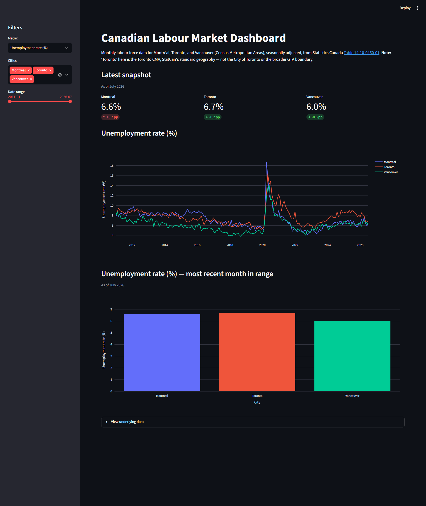

# Canadian Labour Market Dashboard

An interactive Streamlit dashboard tracking monthly labour force data for Montréal, Toronto, and Vancouver, built on Statistics Canada's official labour force survey.

**[Live app →](https://can-labour-dashboard.streamlit.app/)**



## What it does

- Tracks 7 labour market metrics (unemployment rate, employment rate, participation rate, employment, unemployment, labour force, population) from 2011 to present.
- Filter by metric, city, and date range; compare cities on a time series and see the latest month side-by-side.
- Inspect the underlying filtered data directly in the app.

## Data

Source: Statistics Canada, [Table 14-10-0460-01](https://www150.statcan.gc.ca/t1/tbl1/en/tv.action?pid=1410046001) — *Labour force characteristics by Montréal, Toronto and Vancouver census metropolitan areas, monthly, seasonally adjusted*.

The raw StatCan export lives in `data/raw/`. `src/clean.py` filters it down to seasonally-adjusted estimates, maps the three CMAs to short city names, and pivots it into a tidy CSV at `data/clean/labour_tidy.csv` — one row per (date, city) with all metrics as columns.

**Note:** "Toronto" here refers to the Toronto Census Metropolitan Area, StatCan's standard geography for labour force statistics — not the City of Toronto or the broader GTA.

The data is a static snapshot as of the last raw file update, not a live feed.

## Running locally

```bash
python -m venv .venv
.venv\Scripts\activate        # Windows
source .venv/bin/activate     # macOS/Linux

pip install -r requirements.txt

python src/clean.py           # regenerate the tidy CSV from raw data
streamlit run src/app.py
```

The app opens at `http://localhost:8501`.

## Stack

- **pandas** — data cleaning and reshaping
- **Streamlit** — dashboard UI and layout
- **Plotly** — interactive charting

## Project structure

```
data/raw/          StatCan source export (CSV + metadata)
data/clean/         Tidy output consumed by the app
src/clean.py        Raw → tidy transform
src/app.py           Streamlit dashboard
```
